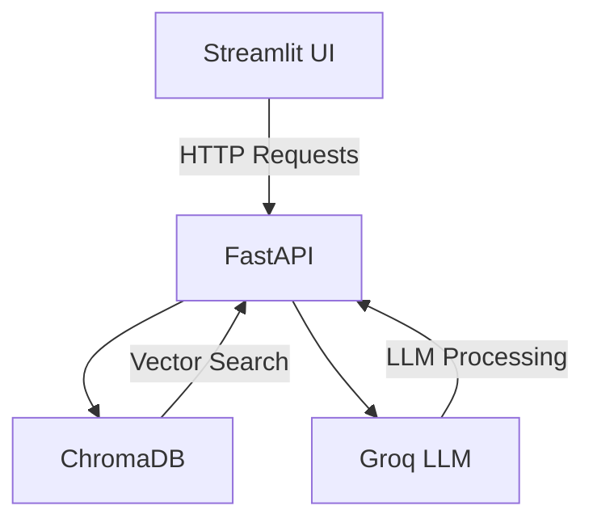

## Invoice Reimbursement System
## Project Overview
- The Invoice Reimbursement System automates the analysis of employee expense invoices against company HR policies using AI. It consists of:

    - FastAPI Backend: Processes invoices, stores data in a vector database, and handles natural language queries.

    - Streamlit UI: Provides an intuitive interface for users to upload invoices and ask questions.

## Folder Structure

```
invoice-reimbursement-system/
├── main.py                # FastAPI backend code
├── app.py                 # Streamlit UI entry point
|── rag_system.py          # RAG application 
├── invoice_system.py      # Invoice analysis logic
├── requirements.txt       # Python dependencies
├── .env                   # Environment variables
├── data/                  # Sample invoices and policies
├── chroma_db/             # vectore database file         
├── README.md
```

### Key Capabilities:
- Automated invoice policy compliance checks
-  Natural language querying via RAG (Retrieval-Augmented Generation)
- Scalable storage with ChromaDB vector database
- Detailed reimbursement analytics

## Installation Instructions
**Prerequisites**
 - Python 3.10+
 - Groq API key (for LLM access)

### Setup
**1. Clone the repository:**
 - git clone https://github.com/your-repo/invoice-reimbursement-system.git
 - cd invoice-reimbursement-system

**2. Create & Activate Virtual Environment (Optional but Recommended)**
 - python3 -m venv venv
 - source venv/bin/activate

**3. Install dependencies:**
 - pip install -r requirements.txt

**4. Create a .env file:**
- GROQ_API_KEY="your-api-key"
- API_URL="http://localhost:8000"  # For local development

**5. Start the services:**

    1. FastAPI Backend. : uvicorn api.main:app --reload
    2. Streamlit UI.    : streamlit run app.py

**6. Access the UI at:**
    - http://localhost:8501

## Usage Guide
**1. Invoice Analysis**
- **Input**:

   - HR Policy (PDF/DOCX)
   - ZIP file containing employee invoices (PDFs)
   - Default employee name (optional)

- **Output**:

    - Processing summary (counts by status)
    - Detailed reimbursement decisions

- **Steps**:

    - Navigate to the "Analyze Invoices" tab
    - Upload required files
    - Click "Analyze Invoices"

**2. Query Mode**
- **Input**:

    - Natural language query (e.g., "Show declined travel expenses")
    - Optional filters (status, employee, date range, amount)

- **Output**:

    - Formatted response with invoice details
    - Policy references for each decision

- **Steps**:

    - Navigate to the "Query Invoices" tab
    - Enter your question
    - Apply filters if needed
    - Click "Search"

## Technical Stack

| Component          | Technology               | Purpose                                   |
|--------------------|--------------------------|-------------------------------------------|
| Backend Framework  | FastAPI                  | API development and endpoint management   |
| Frontend           | Streamlit                | User interface and interaction            |
| Vector Database    | ChromaDB                 | Stores invoice embeddings and metadata    |
| LLM Provider       | Groq (Llama-3)           | Policy analysis and query responses       |
| Embeddings         | all-MiniLM-L6-v2         | Converts text to vector representations   |

### Key Details:
- **FastAPI**: Modern Python framework for building high-performance APIs
- **Streamlit**: Rapid web app development with Python
- **ChromaDB**: Lightweight vector database for semantic search
- **Groq/Llama-3**: High-speed LLM inference for real-time responses
- **all-MiniLM-L6-v2**: Efficient 384-dimension sentence embeddings

## Architecture Overview
*The following diagram shows how the user interface, backend, vector database, and language model interact. This helps both technical and non-technical readers understand the system flow.*


## Prompt Design

**1. Invoice Analysis Prompt**

You are an expert invoice analyzer. Compare this invoice against the HR policy and return:
- Status (Fully/Partially/Declined)
- Exact policy clause violated (include section numbers)
- Approved amount (if partial)
Format: Strict JSON with all required fields.

**2. Query Response Prompt**

You are a reimbursement assistant. Answer the user's question using ONLY the provided invoice data:
1. Start with a summary
2. List each invoice with: Status, Amount, Reason (with policy reference)
3. Format amounts as $X.XX
4. Be concise and factual.


## Challenges & Solutions

This section details the significant challenges faced during development and the solutions implemented to address them.

| Challenge                            | Solution                                   |
| :----------------------------------- | :----------------------------------------- |
| ChromaDB filter syntax complexity    | Implemented a dynamic filter builder       |
| LLM hallucination in responses       | Added strict prompt constraints            |
| PDF text extraction errors           | Fallback to multiple PDF libraries (PyMuPDF,PyPDF2, pdfplumber, python-docx  )      |
| Mixed currency formats               | Auto-detection from reason text            |

